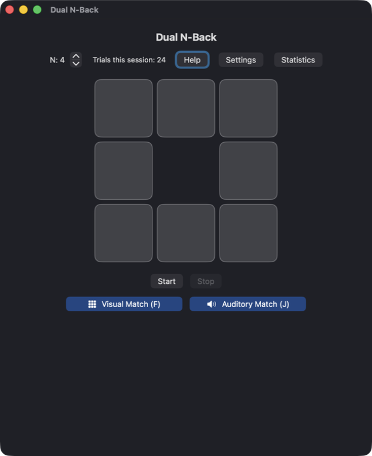
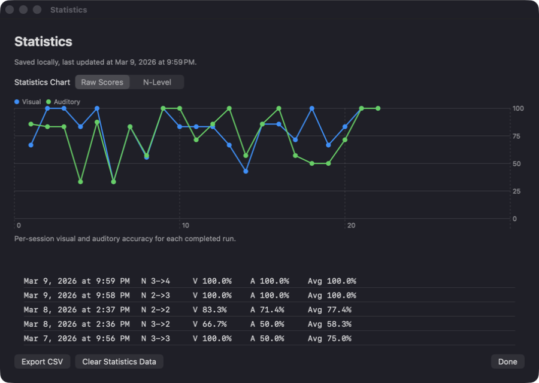

# Dual N-Back

A native macOS dual n-back app built with SwiftUI.

## Screenshots

### Main



### Statistics



## Install

The simplest path is to download a prebuilt app from GitHub Releases.

1. Open the latest release:
   - `https://github.com/eweinhoffer/dual-n-back/releases/latest`
2. Find your Mac architecture:
   - `uname -m`
   - `arm64` = Apple Silicon
   - `x86_64` = Intel
3. Download the matching ZIP:
   - `Dual-N-Back-macOS-unsigned-arm64.zip`
   - `Dual-N-Back-macOS-unsigned-x86_64.zip`
4. Download `SHA256SUMS.txt` from the same release.
5. Verify the download:
   - `shasum -a 256 -c SHA256SUMS.txt`
6. If the release includes signature files, verify them too:
   - `openssl dgst -sha256 -verify release-signing-public.pem -signature SHA256SUMS.txt.sig SHA256SUMS.txt`
7. Unzip `Dual N-Back.app`.
8. Move it to `/Applications`.
9. Open the app and drag it to the Dock if you want quick access.

## Update

### Homebrew

1. Add the tap once:
   - `brew tap eweinhoffer/dual-n-back https://github.com/eweinhoffer/dual-n-back`
2. Install:
   - `brew install --cask dual-n-back`
3. Update later:
   - `brew update && brew upgrade --cask dual-n-back`

### Manual updater script

If you have this repo checked out locally, you can update directly from GitHub Releases:

- Latest stable release:
  - `./scripts/update_from_github.sh`
- Specific tag:
  - `./scripts/update_from_github.sh v1.2.3`

The updater detects your architecture, downloads the correct ZIP, verifies checksums, verifies signatures when present, and installs with rollback protection.

## Important macOS warning

This app is currently unsigned and not notarized.

- macOS Gatekeeper may block the first launch.
- If that happens, right-click `Dual N-Back.app`, choose **Open**, then confirm.
- You may also need:
  - `System Settings > Privacy & Security > Open Anyway`

This is a platform trust-model limitation without a paid Apple Developer account. Use official GitHub Release assets only.

## How to play

- Press `F` for a visual match.
- Press `J` for an auditory match.
- If both match, press both.
- No response is needed for non-matches.

Each trial shows one highlighted square and plays one spoken letter. You compare the current trial to the one `N` steps back. The app tracks hits, misses, and false positives for each stream and adjusts `N` after the session.

## What the app includes

- A main training screen
- A statistics window with history and charting
- CSV export for statistics
- A help sheet
- Settings for startup level, highlight color, and live status text

Session history is stored locally at:
- `~/Library/Application Support/DualNBack/score_history.json`

## Build from source

You only need this if you want to build the app yourself.

### Requirements

- macOS 13 or newer
- Full Xcode 15 or newer in `/Applications/Xcode.app`
- Xcode selected with:
  - `sudo xcode-select -s /Applications/Xcode.app/Contents/Developer`
- First launch completed:
  - `sudo xcodebuild -runFirstLaunch`
- Xcode license accepted:
  - `sudo xcodebuild -license accept`

### Preflight check

Run:

```bash
./scripts/check_build_env.sh
```

### Build

Run:

```bash
./BUILD_DOCK_APP.command
```

The built app appears at:
- `Dual N-Back.app`

### Open in Xcode

1. Open `SwiftDualNBackPrototype/SwiftDualNBackPrototype.xcodeproj`
2. Choose scheme `SwiftDualNBackPrototype`
3. Choose target `My Mac`
4. Run with `Cmd+R`

## Troubleshooting

| Problem | Fix |
|---|---|
| `xcodebuild: command not found` | Install full Xcode, then run `sudo xcode-select -s /Applications/Xcode.app/Contents/Developer` |
| Xcode points to CommandLineTools | Run `sudo xcode-select -s /Applications/Xcode.app/Contents/Developer` |
| First-launch or license errors | Run `sudo xcodebuild -runFirstLaunch` and `sudo xcodebuild -license accept` |
| Build script cannot find `Dual N-Back.app` | Run `./scripts/check_build_env.sh`, then build again |

## Security

- Release ZIPs include `SHA256SUMS.txt`
- Releases can also include `SHA256SUMS.txt.sig` and `release-signing-public.pem`
- Homebrew cask releases are versioned and pin separate `arm64` and `x86_64` hashes
- Local security scan:
  - `./scripts/security_scan.sh`

## More docs

- Screenshot workflow: `PEEKABOO_SCREENSHOTS_README.md`
- Optional release-signing setup: `docs/RELEASE_SIGNING_SETUP.md`
