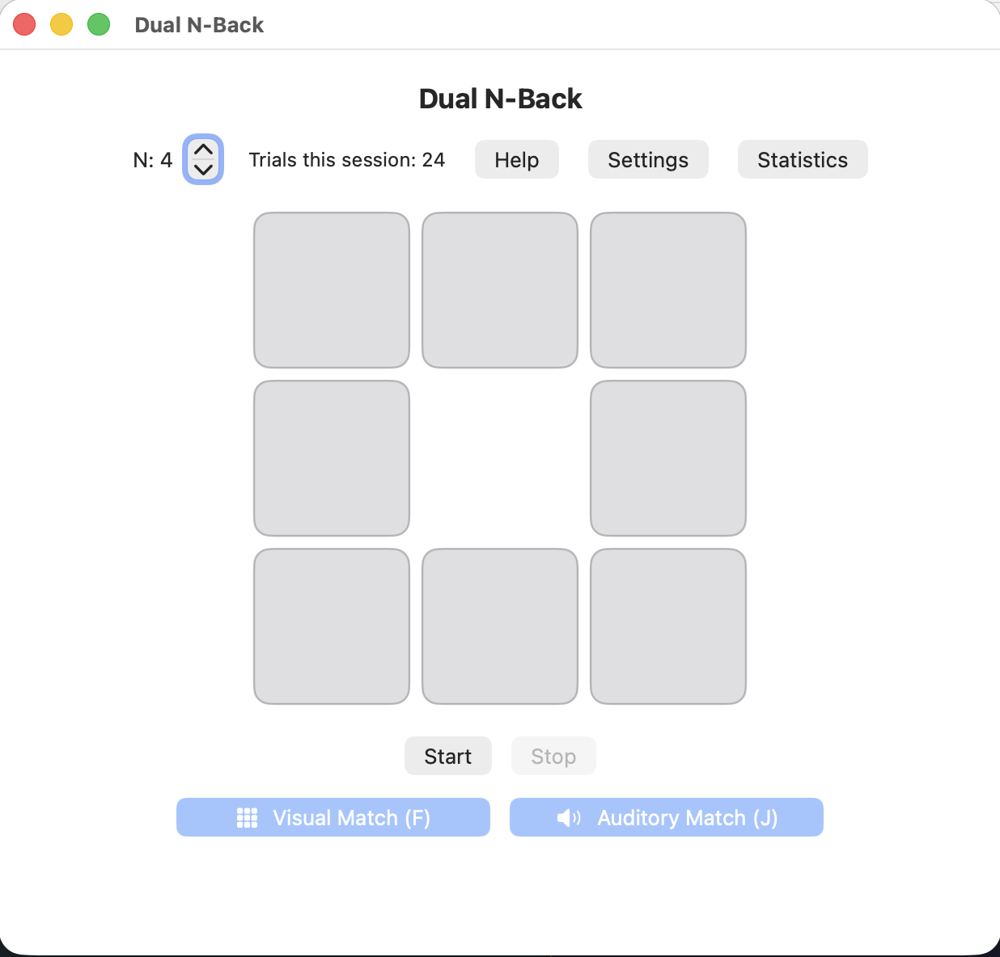
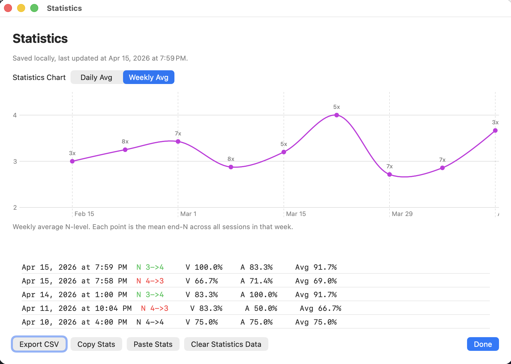
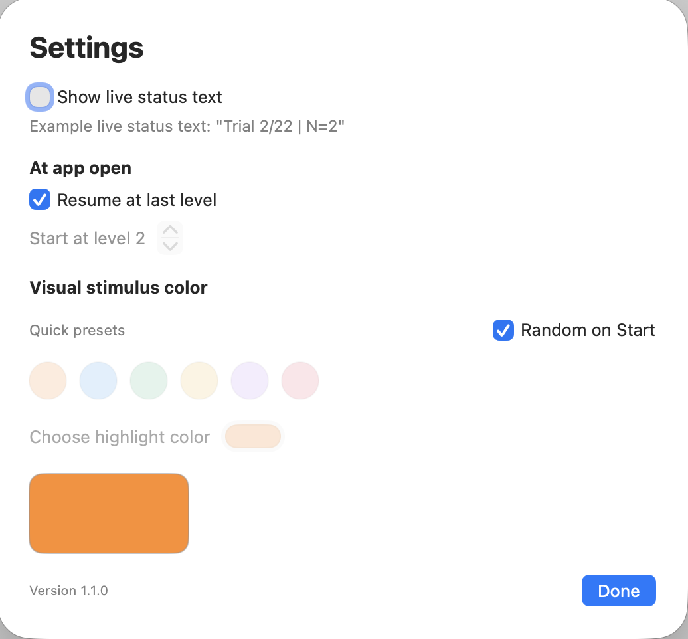

# Dual N-Back



A native macOS and iOS dual n-back cognitive training app.

## 🧠 Features

- 3×3 grid with a visual (position) stimulus and a spoken letter audio stimulus each trial.
- Press `F` for a visual match, `J` for an auditory match — or use the on-screen buttons.
- Adaptive difficulty: N moves up after sessions ≥90% accurate, down below 75%.
- 3-2-1 countdown before each session and match buttons locked during warmup trials.
- Highlight color picker with quick presets and a **Random on Start** option.
- Statistics window with session history, daily and weekly average N-level charts, and CSV export.
- Cross-device stats sync via Universal Clipboard (copy on Mac, paste on iPhone, or vice versa).
- Local-first: all data stored in `~/Library/Application Support/DualNBack/score_history.json`.
- No browser, no Electron, no external dependencies — pure SwiftUI.

## 📸 Screenshots

| Main | Statistics | Settings |
|------|------------|----------|
|  |  |  |

## 📲 Install

### macOS — GitHub Releases

1. Go to the [latest release](https://github.com/eweinhoffer/dual-n-back/releases/latest).
2. Find your architecture: run `uname -m` — `arm64` = Apple Silicon, `x86_64` = Intel.
3. Download the matching ZIP:
   - `Dual-N-Back-macOS-unsigned-arm64.zip`
   - `Dual-N-Back-macOS-unsigned-x86_64.zip`
4. Download `SHA256SUMS.txt` and verify:
   ```bash
   shasum -a 256 -c SHA256SUMS.txt
   ```
5. Unzip and move `Dual N-Back.app` to `/Applications`.

### macOS — Homebrew

```bash
brew tap eweinhoffer/dual-n-back https://github.com/eweinhoffer/dual-n-back
brew install --cask dual-n-back
```

Update later with:

```bash
brew update && brew upgrade --cask dual-n-back
```

### iOS

The iOS app can be installed without a paid Apple Developer account:

- **Xcode (free):** Plug in your iPhone, open `DualNBackiOS/DualNBackiOS.xcodeproj`, set Team to your personal Apple ID, and run with `Cmd+R`. Re-deploy every 7 days.
- **AltStore (free, recommended):** Build an `.ipa` in Xcode, install via [AltStore](https://altstore.io/). Auto re-signs over Wi-Fi every 7 days.
- **Apple Developer Program ($99/year):** Removes the 7-day limit and enables TestFlight.

## ⚠️ macOS Gatekeeper

This app is unsigned and not notarized. macOS Gatekeeper may block the first launch.

If that happens:
- Right-click `Dual N-Back.app`, choose **Open**, then confirm.
- Or go to **System Settings → Privacy & Security → Open Anyway**.

Use official GitHub Release assets only — verify checksums before running.

## 🎮 How to play

Each trial highlights one grid square and plays a spoken letter. You compare the current trial to the one `N` steps back.

- `F` — visual match (same position as N trials ago)
- `J` — auditory match (same letter as N trials ago)
- Both keys — if both match
- Neither — no response needed for non-matches

The app tracks hits, misses, and false positives per stream and adjusts N after each session.

## 🛠️ Build from source

### Requirements

- macOS 13 or newer
- Full Xcode 15+ in `/Applications/Xcode.app`

```bash
sudo xcode-select -s /Applications/Xcode.app/Contents/Developer
sudo xcodebuild -runFirstLaunch
sudo xcodebuild -license accept
```

### Build

```bash
./BUILD_DOCK_APP.command
```

Output: `Dual N-Back.app` in the repo root.

### Open in Xcode

- **macOS + iOS together:** Open `DualNBack.xcworkspace` at the repo root.
- **macOS only:** Open `SwiftDualNBackPrototype/SwiftDualNBackPrototype.xcodeproj`.
- **iOS only:** Open `DualNBackiOS/DualNBackiOS.xcodeproj`.

### Preflight check

```bash
./scripts/check_build_env.sh
```

## 🔧 Troubleshooting

| Problem | Fix |
|---|---|
| `xcodebuild: command not found` | Install full Xcode, run `sudo xcode-select -s /Applications/Xcode.app/Contents/Developer` |
| Xcode points to CommandLineTools | Run `sudo xcode-select -s /Applications/Xcode.app/Contents/Developer` |
| First-launch or license errors | Run `sudo xcodebuild -runFirstLaunch` and `sudo xcodebuild -license accept` |
| Build script can't find app | Run `./scripts/check_build_env.sh`, then build again |

## 🔒 Security

- Release ZIPs include `SHA256SUMS.txt` for checksum verification.
- Optional release signatures via `SHA256SUMS.txt.sig` and `release-signing-public.pem`.
- Homebrew cask pins separate `arm64` and `x86_64` hashes per release.
- Local security scan: `./scripts/security_scan.sh`

## ✍️ Author

Developed by [Eric Weinhoffer](https://www.ericweinhoffer.com)

[](https://www.buymeacoffee.com/eweinhoffer)

## 📄 License

MIT
