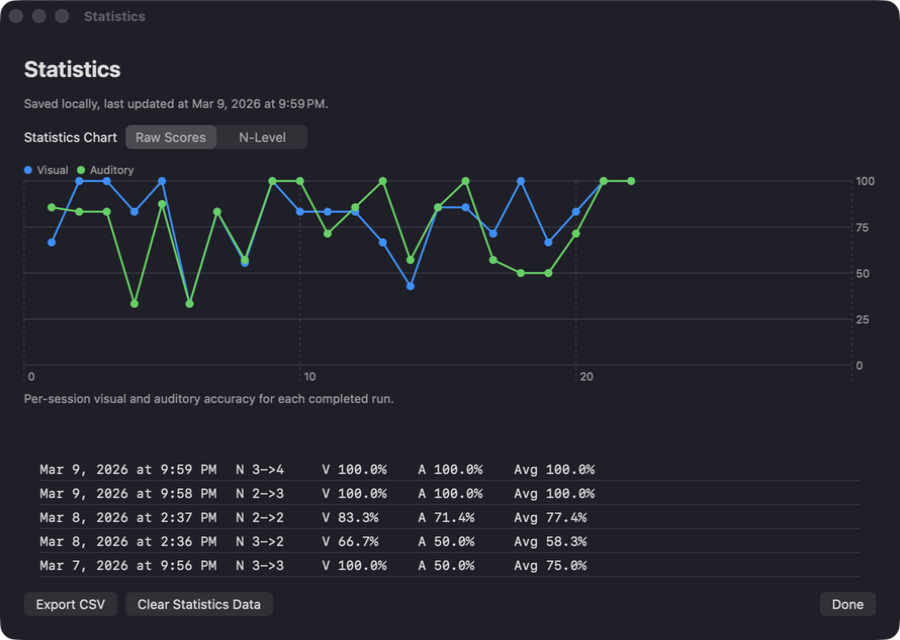

# Dual N-Back

A native macOS dual n-back app built with SwiftUI.

## Project Snapshot

- Current app version in the Xcode project: `1.1.0`
- Current shape of the project: native SwiftUI macOS app, local-first data storage, GitHub Release packaging, Homebrew cask, and a small set of maintenance scripts
- Current trust model: the app is still unsigned and not notarized, so release safety currently depends on checksums, optional signature files for the checksum manifest, and careful documentation
- Main user goal: make dual n-back training feel simple on macOS without needing a browser, Electron app, or manual score tracking

## What Exists Today

- Main training window with a 3x3 ring, visual stimulus, spoken audio stimulus, and keyboard/button input
- Adaptive difficulty where `N` can move up or down after a session based on average accuracy
- Countdown before session start, clearer button states, resizable windows, and better general UX polish
- Help sheet and settings sheet
- Statistics window with saved history, charts, clear-history support, and CSV export
- Local persistence for score history in `~/Library/Application Support/DualNBack/score_history.json`
- Local build tooling, screenshot capture tooling, a GitHub release workflow, a Homebrew cask, and a local updater script

## Maintainer Context

This section is meant to answer, in plain English, "what have we already done, what did we learn, and what is left?"

### What Has Been Done So Far

- The project started as a Python dual n-back prototype.
- The main app was then moved to a native SwiftUI macOS implementation.
- A one-click Xcode project was added so the app could be opened and built more easily.
- The game logic was updated to follow the intended dual n-back rules more closely, including adaptive progression.
- The UX was improved with countdown timing, richer voice playback, better click targets, and resizable windows.
- The app was made more "Dock-ready" by packaging it as a macOS app bundle instead of leaving it as only a development prototype.
- Statistics tracking and settings persistence were added, which turned the app from "toy prototype" into something closer to a usable personal training app.
- Project hygiene was improved by scrubbing local path references and anonymizing the bundle identifier.
- Release automation was added so tagged releases can build artifacts, generate checksum files, optionally sign the checksum manifest, and publish assets to GitHub Releases.
- Homebrew support was added and then backed by a smoke-test workflow so install instructions are less theoretical.
- Screenshot tooling and documentation were added so the README and release docs can be refreshed more consistently.

### Major Lessons Learned

- Full Xcode matters. On macOS, Command Line Tools alone are not enough for a smooth app build experience, so the repo now checks for the full Xcode install first.
- Native SwiftUI was the right direction for this project. It made the app feel more "real" on macOS and made packaging/distribution cleaner than staying with the original prototype approach.
- Distribution is not just "build a ZIP." Because the app is unsigned and not notarized, the install story needed checksum verification, optional release-signature support, clearer Gatekeeper instructions, and safer updater behavior.
- Small automation pays off fast. The release pipeline, cask update helper, screenshot script, and security scan reduce repetitive mistakes and make future releases less stressful.
- Security needs active guardrails. This repo already shows that in a few ways: path-scrubbing, a repo security scan, optional release signing, and screenshot guidance that warns against accidentally capturing private information.
- Persistence changes the shape of the product. Once session history, charts, and CSV export were added, the app shifted from "single-session trainer" to "something you can actually track progress with over time."

### Current Goals

- Keep the app simple and fast for personal dual n-back training on macOS.
- Make installation easier for non-technical users through GitHub Releases and Homebrew.
- Keep everything local-first for training data.
- Improve release safety without overcomplicating the project.

### Code Map

- `SwiftDualNBackPrototype/Sources/SwiftDualNBackPrototype/Engine/GameEngine.swift`
  Owns trial generation, countdown, timing, speech, scoring, adaptive `N`, and saving completed sessions.
- `SwiftDualNBackPrototype/Sources/SwiftDualNBackPrototype/Views/ContentView.swift`
  Main training window, controls, keyboard integration, and sheet/window launching.
- `SwiftDualNBackPrototype/Sources/SwiftDualNBackPrototype/Views/StatisticsView.swift`
  Saved-session list, charts, CSV export, and destructive clear-history action.
- `SwiftDualNBackPrototype/Sources/SwiftDualNBackPrototype/Storage/StatisticsStore.swift`
  Reads and writes score history JSON under Application Support.
- `BUILD_DOCK_APP.command`
  Main local build entry point, including SwiftPM fallback packaging if the Xcode build path fails.
- `.github/workflows/release.yml`
  Main release automation.

### Next Steps Still Open

- Code signing and notarization are still the biggest unfinished platform task. That would improve user trust and reduce Gatekeeper friction.
- Automated tests are still light or absent. The app would benefit from tests around trial-plan generation, score calculation, and adaptive level changes.
- The release pipeline is good, but it still depends on careful human release discipline. A short maintainer checklist could make releases even safer.
- Screenshot assets should be kept tidy. There are currently untracked screenshot files in the working tree, which is harmless locally but worth cleaning before a release or commit.
- If the project becomes more public-facing, it may make sense to split "user README" and "maintainer notes" into separate docs. For now, both are kept here for convenience.

## Screenshots

### Main


### Statistics



## Install

The simplest path is to download a prebuilt app from GitHub Releases.

1. Open the latest release:
   - `https://github.com/eweinhoffer/dual-n-back/releases/latest`
2. Find your Mac architecture:
   - `uname -m`
   - `arm64` = Apple Silicon
   - `x86_64` = Intel
3. Download the matching ZIP:
   - `Dual-N-Back-macOS-unsigned-arm64.zip`
   - `Dual-N-Back-macOS-unsigned-x86_64.zip`
4. Download `SHA256SUMS.txt` from the same release.
5. Verify the download:
   - `shasum -a 256 -c SHA256SUMS.txt`
6. If the release includes signature files, verify them too:
   - `openssl dgst -sha256 -verify release-signing-public.pem -signature SHA256SUMS.txt.sig SHA256SUMS.txt`
7. Unzip `Dual N-Back.app`.
8. Move it to `/Applications`.
9. Open the app and drag it to the Dock if you want quick access.

## Update

### Homebrew

1. Add the tap once:
   - `brew tap eweinhoffer/dual-n-back https://github.com/eweinhoffer/dual-n-back`
2. Install:
   - `brew install --cask dual-n-back`
3. Update later:
   - `brew update && brew upgrade --cask dual-n-back`

### Manual updater script

If you have this repo checked out locally, you can update directly from GitHub Releases:

- Latest stable release:
  - `./scripts/update_from_github.sh`
- Specific tag:
  - `./scripts/update_from_github.sh v1.2.3`

The updater detects your architecture, downloads the correct ZIP, verifies checksums, verifies signatures when present, and installs with rollback protection.

## Important macOS warning

This app is currently unsigned and not notarized.

- macOS Gatekeeper may block the first launch.
- If that happens, right-click `Dual N-Back.app`, choose **Open**, then confirm.
- You may also need:
  - `System Settings > Privacy & Security > Open Anyway`

This is a platform trust-model limitation without a paid Apple Developer account. Use official GitHub Release assets only.

## How to play

- Press `F` for a visual match.
- Press `J` for an auditory match.
- If both match, press both.
- No response is needed for non-matches.

Each trial shows one highlighted square and plays one spoken letter. You compare the current trial to the one `N` steps back. The app tracks hits, misses, and false positives for each stream and adjusts `N` after the session.

## What the app includes

- A main training screen
- A statistics window with history and charting
- CSV export for statistics
- A help sheet
- Settings for startup level, highlight color, and live status text

Session history is stored locally at:
- `~/Library/Application Support/DualNBack/score_history.json`

## Build from source

You only need this if you want to build the app yourself.

### Requirements

- macOS 13 or newer
- Full Xcode 15 or newer in `/Applications/Xcode.app`
- Xcode selected with:
  - `sudo xcode-select -s /Applications/Xcode.app/Contents/Developer`
- First launch completed:
  - `sudo xcodebuild -runFirstLaunch`
- Xcode license accepted:
  - `sudo xcodebuild -license accept`

### Preflight check

Run:

```bash
./scripts/check_build_env.sh
```

### Build

Run:

```bash
./BUILD_DOCK_APP.command
```

The built app appears at:
- `Dual N-Back.app`

### Open in Xcode

1. Open `SwiftDualNBackPrototype/SwiftDualNBackPrototype.xcodeproj`
2. Choose scheme `SwiftDualNBackPrototype`
3. Choose target `My Mac`
4. Run with `Cmd+R`

## Troubleshooting

| Problem | Fix |
|---|---|
| `xcodebuild: command not found` | Install full Xcode, then run `sudo xcode-select -s /Applications/Xcode.app/Contents/Developer` |
| Xcode points to CommandLineTools | Run `sudo xcode-select -s /Applications/Xcode.app/Contents/Developer` |
| First-launch or license errors | Run `sudo xcodebuild -runFirstLaunch` and `sudo xcodebuild -license accept` |
| Build script cannot find `Dual N-Back.app` | Run `./scripts/check_build_env.sh`, then build again |

## Security

- Release ZIPs include `SHA256SUMS.txt`
- Releases can also include `SHA256SUMS.txt.sig` and `release-signing-public.pem`
- Homebrew cask releases are versioned and pin separate `arm64` and `x86_64` hashes
- Local security scan:
  - `./scripts/security_scan.sh`

## More docs

- Screenshot workflow: `PEEKABOO_SCREENSHOTS_README.md`
- Optional release-signing setup: `docs/RELEASE_SIGNING_SETUP.md`
- Scripts and automation notes: `AUTOMATIONS_README.md`
